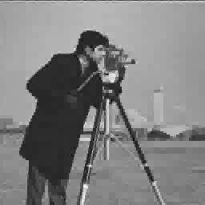

# Restoration with Figureiredo Nowak Algorithm

1. Compile c code: ```./compilegcc RestorationWithFigureiredoNowak``` 
2. Run executable file: ```./RestorationWithFigureiredoNowak```
3. Input the size of low-pass filter: ```5``` <br>
   Input the variance of noise : ```20```  <br>
   Input the number of iterations (LANDWEBER): "20" <br>
4. Output 3 image: original image, noised+blured image and restored image
5. Results
<br>



